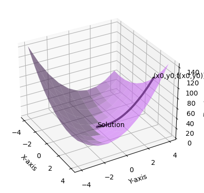

# Gradient Descent?

Let’s suppose you're lost somewhere in the mountains. In a situation where you don’t know exactly where you are, the best way to find your way down might be to simply follow the slope. The steeper the slope, the quicker you’ll reach the lowest point. This post explains an algorithm called gradient descent, which solves optimization problems, such as those in convolution functions.

>Where exactly is it used? 🤔

In machine learning, a loss function is used to calculate the difference between the predicted values and the actual values. Gradient descent is then used to find the minimum of the loss function.

---

# The Concept of Gradient Descent

## Descent


>(a) \\\(x_{k+1} = x_{k} + t_k \Delta{x_k},k=0,1,...\\\) (where \\\(t_k>0\\\))

>(b) \\\(f(x_{k+1})<f(x_k\\\))

위의 조건을 가진 수식을 이용해 최적화 문제를 푸는 방식을 하강법이라 정의합니다. 즉 $k$가 증가하면 함수값이 계속 감소하도록 수열을 설정하는 것이 관건입니다.

---

## 경사하강법

경사하강법에 쓰이는 목적함수는 볼록함수입니다. 볼록함수의 정의에 의해

\\\(f(x_{k+1}) \geq f(x_k)+\nabla f(x_k)^T(x_{k+1}-x_k)\\\)

가 성립합니다. 이때 위 하강법 정의 (b)가 성립하려면

$\nabla f(x_k)^T(x_{k+1}-x_k)<0$이고 이식을 (a)를 이용해 정리하면

$\nabla f(x_k)^T t_k\Delta{x_k}<0$ 이 되어야 합니다.

$t_k$는 양수이기에 $\Delta{x_k}$를 설정하겠습니다.

> ❗️ 다변수 함수 $f:R^n \rightarrow R$이 가장 빠르게 증가하는 방향은 $\nabla f$	방향이다.
> 

위 정리를 거꾸로 말하면 $\Delta{x_k}$를  $-\nabla f(x_k)$로 놓으면 **가장 빠르게 감소하는 방향**으로 $x_k$가 향한다는 것을 알 수 있습니다.

그럼 이것을 파이썬으로 구현해보고 그래프로 한번 확인해보겠습니다.

## 🧑🏻‍💻 경사하강법 코딩하기

> $f(x) = 2x^2+3xy+4y^2$ 일 때, $minimize_{x \in R^2} f(x)$를 경사하강법을 이용해 풀어보세요. (단, $x_0=(2,4), t_k=0.01, \epsilon=10^{-8}$)
> 

```python
# 목적함수
def f(x,y):
    return 2*x**2 + 3*x*y + 4*y**2

# 목적함수를 x로 편미분한 함수
def fx(x,y):
    return 4*x+3*y

# 목적함수를 y로 편미분한 함수
def fy(x,y):
    return 3*x+8*y

# x_k,y_k의 좌표를 받을 리스트
xlist,ylist=[2],[4]

# 설정 값
x0,y0 = 2,4
t=0.01
eps=10**(-8)

iter=0
xk,yk=x0,y0

while True:
    tk=t

    # xkp1 = xk - tk * delta(xk)
    xkp1=xk-tk*fx(xk,yk)
    ykp1=yk-tk*fy(xk,yk)

    xlist.append(xkp1)
    ylist.append(ykp1)

    if np.linalg.norm(np.array((xkp1-xk,ykp1-yk)))<eps:
        print(f'iterated {iter} times')
        print(f'GD converges to {round(xkp1,1),round(ykp1,1)}')
        break

    iter = iter + 1
    xk,yk = xkp1, ykp1

```

!https://velog.velcdn.com/images/braveveigar/post/573dd804-b6cb-4504-a08e-5d2d7d44ccd4/image.png

520번 경사하강법을 실행해서 (0,0) 즉 해에 수렴하는 것을 확인할 수 있습니다.

---

## 🧑🏻‍💻 Plotting Graph

```python
from mpl_toolkits.mplot3d import axes3d
import matplotlib.pyplot as plt
from matplotlib import animation

# x,y 값에 따른 z 좌표 리스트
zlist=[]
for i in range(len(xlist)):
	zlist.append(f(xlist[i],ylist[i]))

# 그래프 생성
fig = plt.figure()
ax = fig.add_subplot(111, projection='3d')
ax.view_init(elev=30, azim=-30)

# x, y 값 생성
x = np.linspace(-4, 4, 10)
y = np.linspace(-4, 4, 10)
x, y = np.meshgrid(x, y)

# z 값 계산
z = f(x,y)

# plotting 3D
ax.plot_surface(x,y,z,color='#d070fb', alpha = 0.6)
ax.plot(xlist,ylist,zlist,lw=3, color='black')
ax.text(xlist[0],ylist[0],zlist[0],'(x0,y0,f(x0,y0))')
ax.text(xlist[-1],ylist[-1],zlist[-1],'Solution')

# Labeling x, y, z
ax.set_xlabel('X-axis')
ax.set_ylabel('Y-axis')
ax.set_zlabel('Z-axis')

plt.show()

```



Point converges to (0,0)

---